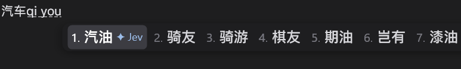

# Rime AI 智能输入法 (Rime AI Input Method)

<div align="center">


**融合小狼毫 (Weasel) · 万象拼音海量词库 · TypeSafe Jev AI / Ollama · macOS 极简暗黑胶囊主题 · 图形化交互设置中心**

</div>

---

## ✨ 核心特性

- 🎨 **8 大精品预设主题 + 实时自由调色盘**  
  默认搭载原装 **macOS 极简暗黑胶囊**（`#201E1E` 半透明底 + `#423C3C` 高亮胶囊 + 苹方粗体），并扩展提供**极简浅色胶囊、深空蓝夜、莫卡暗夜 (Catppuccin Mocha)、东京之夜 (Tokyo Night)、北极极光 (Nord Dark)、樱花浅粉 (Sakura Pink)**。更支持 **自由自定义调色盘**，对背景底色、边框、高亮胶囊、高亮字色、普通候选字色、序号注释颜色进行 6 维拾色，设置面板实时候选条秒级动态渲染！
- 🧠 **双模 AI 语义重排与预测**  
  支持 **TypeSafe Jev AI** 毫秒级上下文决策与本地 **Ollama（如 Qwen 8B）** 开源大模型。支持 **`Tab` 键智能召唤模式**：常规打字零进程、零卡顿、极速飞快；支持一键开启 Windows 开机静默后台自启（零黑框），开机随时按 Tab 键主动召唤 AI（带 `✦ Jev` 标记）。
- 📖 **本地自定义词库与快捷短语可视化管理**  
  原生集成 `custom_phrase.dict.yaml` 用户词库管理系统。在设置面板中可一键添加邮箱、手机号、常用长句，并内置快捷插入万象拼音强大的动态宏：当前日期（`\Y-\m-\d \D`）、时辰刻度（`\T\K`）、字符重复（`哈\5`）、换行（`\n`）等；支持可视化表格检索管理与原始 YAML 源码批量编辑双模式。
- 📚 **万象拼音顶级词库与 400MB 语法模型**  
  集成持续活跃维护的 [amzxyz/rime-wanxiang](https://github.com/amzxyz/rime-wanxiang) 全套 20 个精品词典（45MB 基础大词库 + 地名/诗词/搜狗专业词库，编译后达 82MB 检索表）。支持一键加载官方 **400MB Octagram 语法语言模型**，实现大厂级整句智能预测（带 `∞` 标识）。
- 🎛️ **现代图形化交互设置面板 (Web GUI)**  
  无需面对繁杂晦涩的 YAML 语法！内置基于 Python 原生轻量引擎的 Apple macOS 风格控制中心，支持**实时候选栏动态渲染预览**（支持一键切换 Jev AI 召唤场景与 400MB 语法预测场景），一键调节候选词数量、纯英文标点模式、单键 Ctrl 上屏、字体字号并一键编译生效。
- 💎 **高清现代胶囊蓝“中”/灰“A”托盘图标**  
  提供一键注入工具，自动替换任务栏老旧印章图标为高分辨率现代圆角语言图标。
- 🛡️ **严格安全与隐私脱敏**  
  所有敏感凭证（如 Jev API Key）均保存在本地 `.env` 并纳入 `.gitignore`，绝不上传云端，打字数据完全本地闭环。

---

## 📸 效果预览

### ✦ Jev AI 智能召唤打字实测（输入「汽车qi you」按 Tab 智能预测「汽油」）
<div align="center">
  
</div>

### 实时候选条效果（macOS 极简暗黑胶囊 + 苹方粗体 + 8 候选）
```text
汽车qi you
┌────────────────────────────────────────────────────────────────────────┐
│ 1. 汽油 ✦ Jev  2. 骑友  3. 骑游  4. 棋友  5. 期油  6. 岂有  7. 漆油  8. 七有 │
└────────────────────────────────────────────────────────────────────────┘
```

### Apple macOS 拟态图形化控制中心 (WebUI)
<div align="center">
  
</div>

---

## 🚀 极速上手

### 1. 克隆或下载本仓库
```bash
git clone https://github.com/Love-Neko/Rime-Capsule-AI.git
cd Rime-Capsule-AI
```

### 2. 双击启动
仓库根目录下提供了两款快捷批处理脚本：
- **`一键启动.bat`**：🚀 **一键启动懒人包**，自动检测 Python 环境，并在后台拉起 Jev AI 决策服务与小狼毫服务，同时自动在浏览器中弹出设置控制中心。
- **`打开设置面板.bat`**：仅启动本地图形化设置控制中心并打开浏览器。

### 3. 一键个性化定制与部署
在控制面板中，您可以自由勾选与调整：
- **主题配色方案**：8 大预设主题（暗黑胶囊、浅色胶囊、深空蓝夜、莫卡暗夜、东京之夜、北极极光、樱花浅粉）+ 自由调色盘
- **本地自定义词库**：可视化表格或原始 YAML 模式轻松增删自定义短语与动态宏（`custom_phrase.dict.yaml`）
- **候选词个数**：5 / 7 / 8 / 9 / 10 个（推荐 8 个）
- **单键 Ctrl 极速切换**：开启后，打完英文按 Ctrl 自动将英文字符直接上屏并切回中文；彻底屏蔽 Shift 误触
- **纯英文半角标点模式**：无论中英状态，标点符号（`, . ? ! : ;` 等）永远输出英文半角
- **翻页快捷键**：支持 `[` `]` 翻页、`-` `=` 翻页或 `,` `.` 翻页
- **AI 决策配置**：填入您的 Jev API Key（可选）或配置本地 Ollama 模型
- **400MB 语法模型**：点击【一键下载 400MB 语法模型】享受整句预测体验

调整满意后，点击右下角 **【保存并一键部署到输入法】**，后台将自动生成配置并重新编译加载！

---

## ⌨️ 常用快捷键速查表

| 操作 / 功能 | 快捷键 | 说明 |
| :--- | :--- | :--- |
| **中英模式切换** | `Ctrl` 单键 | 打英文途中直接按 `Ctrl` 将字母上屏并切回中文 |
| **候选词向上翻页** | `[` 或 `-` | 可在设置面板自选按键映射 |
| **候选词向下翻页** | `]` 或 `=` | 可在设置面板自选按键映射 |
| **智能召唤 Jev AI** | `Tab` | 候选框展开时按 Tab 唤醒 Jev AI 决策重排 |
| **大写锁定切换** | 短按 `Caps Lock` | 切换大小写指示灯 |
| **标点符号** | 键盘任意标点键 | 默认或根据设置直接输出半角英文标点 |

---

## 📂 项目结构说明

```text
rime-ai-shurufa/
├── .env.example                  # 环境变量模板（敏感 Key 脱敏）
├── .gitignore                    # 忽略规则（保护隐私密钥与超大二进制模型）
├── LICENSE                       # MIT 开源许可证
├── README.md                     # 本说明文档
├── requirements.txt              # 依赖声明（仅标准库，零强制依赖）
├── 一键启动.bat                   # 🚀 一键启动懒人包（自动拉起后台服务并弹出设置中心）
├── 打开设置面板.bat               # 🎛️ 独立快捷启动设置控制中心
├── run_bridge.py                 # Jev AI 桥接服务端入口
│
├── settings_panel/               # 交互设置中心模块
│   ├── app.py                    # 后台 HTTP API 与配置管理
│   ├── settings.json             # 当前保存的自定义配置状态
│   └── web/                      # 前端静态页面
│       ├── index.html            # 控制中心主界面
│       ├── style.css             # Apple macOS Glassmorphism 样式
│       └── script.js             # 实时预览与交互逻辑
│
├── rime_config/                  # 输入法配置核心与字典集
│   ├── dicts/                    # 20 个万象精品拼音词典（45MB+基础词库）
│   ├── opencc/                   # 字符转换规则
│   ├── custom/                   # 方案拓展
│   ├── custom_phrase.dict.yaml   # 用户自定义词库与动态宏规则
│   ├── wanxiang.*.yaml           # 万象拼音方案与词典元数据
│   ├── default.custom.yaml       # 快捷键、切换与候选数配置
│   └── weasel.custom.yaml        # 暗黑胶囊/多预设主题与字体定义
│
├── lua/                          # Rime Lua 扩展插件
│   ├── rime.lua                  # Lua 模块加载入口
│   ├── jev_filter.lua            # Jev AI 候选重排过滤器
│   └── wanxiang/                 # 万象核心 Lua 组件集
│
├── tools/                        # 自动化维护工具
│   ├── autostart.py              # Windows 开机静默后台自启管理脚本
│   ├── deploy.py                 # 配置同步与编译部署脚本
│   ├── download_model.py         # 400MB 语法模型断点续传下载工具
│   ├── patch_icons.py            # 托盘图标一键更新为 macOS 蓝中/灰A
│   └── render_preview.py         # 4K Retina 超清截图生成脚本
│
└── assets/                       # 图标与静态资源
    ├── jev_preview.png           # 真实输入法 Jev AI 决策上屏效果截图
    ├── preview.png               # 设置控制中心 Retina 2x 超清预览图
    ├── zh_modern.ico             # 高清 macOS 皇家蓝“中”
    └── en_modern.ico             # 高清 macOS 深空灰“A”
```

---

## 🤝 鸣谢与致敬

- [Rime 输入法引擎 (小狼毫 Weasel)](https://github.com/rime/weasel)
- [amzxyz/rime-wanxiang (万象拼音)](https://github.com/amzxyz/rime-wanxiang)
- [TypeSafe AI Jev](https://typesafe.ai)

---

## 📄 开源许可证

本项目基于 [MIT License](LICENSE) 开源发布。
